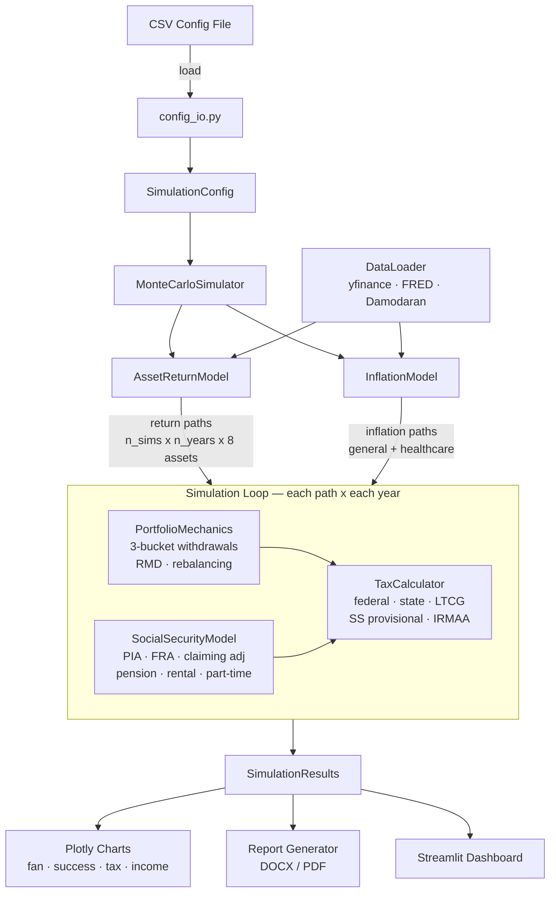

# Architecture

## Simulation Flow



## Module Responsibilities

### `config/defaults.py`
Defines `SimulationConfig`, the single dataclass that holds every parameter for a simulation run — ages, balances, allocation targets, spending, Social Security inputs, tax assumptions, and model settings. Also defines `SimulationResults`, which stores the output arrays. All tax brackets, RMD tables, IRMAA thresholds, and Social Security bend points are constants in this file. Every other module reads from `SimulationConfig`; none modifies it.

### `models/simulation.py`
The `MonteCarloSimulator` orchestrator. Pre-generates correlated return and inflation matrices, then runs an outer loop over `n_simulations` and an inner loop over retirement years. Each year it calls `PortfolioMechanics.process_year()`, collects Social Security and other income via `SocialSecurityModel`, computes taxes via `TaxCalculator`, and records portfolio balances. Also provides `run_deterministic()` for single-path analysis and `calculate_safe_withdrawal_rate()` using binary search.

### `models/asset_returns.py`
Generates stochastic return paths across 8 asset classes (US Large Cap, US Small Cap, International Developed, Emerging Markets, US Bonds, TIPS, REITs, Cash). Supports block bootstrap (sampling historical return blocks) and GBM with Cholesky-correlated noise. Falls back to embedded 1970–2024 statistics if network data downloads fail. The `DataLoader` provides historical return CSVs; this module consumes them.

### `models/inflation.py`
Generates inflation paths using bootstrap (resample historical CPI), fixed rate, or mean-reverting (Ornstein-Uhlenbeck) models. Applies a healthcare inflation overlay that adds a configurable spread above general inflation. Output is consumed by the simulation loop to convert nominal values to real.

### `models/portfolio.py`
Implements the three-bucket portfolio model (Traditional IRA/401k, Roth IRA, Taxable brokerage). Handles tax-aware withdrawal ordering: Taxable first, then Traditional (at least RMD), then Roth. Manages glide-path allocation shifts over time, threshold-based rebalancing, cost basis tracking for capital gains, and fee deduction. The `process_year()` method is the main entry point called by the simulator each year.

### `models/tax.py`
`TaxCalculator` applies 2025 federal income tax brackets, long-term capital gains rates, Social Security provisional income testing (to determine taxable SS percentage), state tax, senior standard deduction, and IRMAA surcharge estimation. It receives income components from the simulation loop and returns total tax liability for the year.

### `models/social_security.py`
Computes Primary Insurance Amount (PIA) from Average Indexed Monthly Earnings (AIME) using bend points, applies early-reduction or delayed-retirement credits based on claiming age vs. Full Retirement Age (FRA), and calculates basic spousal benefits (50% of primary PIA). Also aggregates income overlays — pension, rental, part-time work — keyed by age.

### `utils/charts.py`
Plotly chart builders for the Streamlit dashboard. Generates portfolio fan charts (percentile bands), success probability curves, tax burden over time, income stacking, asset allocation pies, inflation paths, withdrawal schedules, portfolio depletion histograms, and balance line plots. All charts use a consistent dark theme.

### `utils/config_io.py`
CSV import/export for `SimulationConfig`. `save_config_csv()` serializes all config fields to a two-column CSV (field name, value). `load_config_csv()` reads that CSV back into a `SimulationConfig`, handling type inference, enum normalization, allocation validation, and field validation. Enables saving/loading configurations between sessions.

### `utils/report_generator.py`
Generates Word (DOCX) and PDF reports from `SimulationResults`. Builds matplotlib charts (separate from Plotly dashboard charts), assembles them into a formatted document with cover page, executive summary, data tables, income breakdown, common-sense checks, and assumptions log. PDF conversion uses LibreOffice if available.

### `utils/helpers.py`
Formatting utilities (`fmt_dollar`, `format_percent`, `format_age`), real/nominal value converters, cumulative inflation calculation, percentile computation, allocation validation and normalization, and other shared helpers used across modules.

### `data/loader.py`
Downloads and caches historical data from yfinance (equity returns), FRED (CPI/inflation), and Damodaran (asset class statistics) into `data/cache/` as CSV files. Provides fallback embedded parameters if network is unavailable. Cache is checked before downloading.

## Data Flow

```
CSV input file
    │
    ▼
config_io.load_config_csv()
    │
    ▼
SimulationConfig (dataclass — single source of truth)
    │
    ├──► AssetReturnModel.get_returns()  → return matrix [n_sims × n_years × 8]
    ├──► InflationModel.generate()       → inflation matrix [n_sims × n_years]
    │
    ▼
MonteCarloSimulator.run()
    │   for each simulation path:
    │     for each year:
    │       PortfolioMechanics.process_year()  → withdrawals, balances, RMD
    │       SocialSecurityModel.get_income()   → SS + pension + overlays
    │       TaxCalculator.calculate_annual_tax() → total tax
    │
    ▼
SimulationResults (dataclass — output arrays)
    │
    ├──► Plotly charts (Streamlit dashboard)
    ├──► ReportGenerator (DOCX / PDF export)
    └──► Excel export
```

## Dependency Graph

Modules form a strict DAG — no circular imports.

```
SimulationConfig (config/defaults.py)
        │
        ▼
┌───────────────────────────────┐
│     MonteCarloSimulator       │  ← orchestrator
│     (models/simulation.py)    │
└───────────┬───────────────────┘
            │ calls
    ┌───────┼───────────┬──────────────┐
    ▼       ▼           ▼              ▼
AssetReturn Inflation  Portfolio    SocialSecurity
  Model      Model     Mechanics      Model
    │                     │              │
    │                     ▼              │
    │               TaxCalculator ◄──────┘
    │
    ▼
DataLoader (data/loader.py)
```

No module imports from `app.py`. All modules import from `config/defaults.py` for type definitions. Utilities (`helpers`, `charts`, `config_io`, `report_generator`) are leaf nodes — they consume results but are not imported by core models.

## Key Data Structures

### `SimulationConfig`
Central configuration dataclass. Key field groups:

| Group | Fields | Purpose |
|-------|--------|---------|
| Demographics | `current_age`, `retirement_age`, `life_expectancy`, `spouse_age`, `spouse_life_expectancy` | Simulation timespan |
| Portfolio | `traditional_balance`, `roth_balance`, `taxable_balance`, `allocation` | Starting state |
| Spending | `spend_annual_real` | Annual real spending target |
| Social Security | `ss_monthly_benefit`, `ss_claiming_age`, `spouse_ss_*`, `include_spousal_benefit` | SS income modeling |
| Income Overlays | `pension_annual`, `rental_income`, `part_time_income`, `part_time_end_age` | Non-portfolio income |
| Tax | `state_tax_rate`, `filing_status` | Tax assumptions |
| Model Settings | `n_simulations`, `return_model`, `inflation_model` | Engine configuration |

### `SimulationResults`
Output arrays indexed by `[simulation, year]`:

| Field | Shape | Description |
|-------|-------|-------------|
| `portfolio_paths` | `[n_sims, n_years]` | Total portfolio balance each year |
| `withdrawal_paths` | `[n_sims, n_years]` | Amount withdrawn each year |
| `tax_paths` | `[n_sims, n_years]` | Total tax paid each year |
| `income_paths` | `[n_sims, n_years]` | Total income (SS + overlays) |
| `inflation_paths` | `[n_sims, n_years]` | Cumulative inflation factor |
| `success_rate` | scalar | Fraction of paths where portfolio survived |
| `median_terminal` | scalar | Median final portfolio balance |

## Extension Points

### Adding a new asset class
1. Add the asset class name to `ASSET_CLASSES` in `config/defaults.py`
2. Add historical return data to `data/cache/historical_returns.csv` (or update `DataLoader` to fetch it)
3. Add fallback mean/std to the embedded statistics in `models/asset_returns.py`
4. Update the correlation/covariance computation in `AssetReturnModel._compute_covariance()`
5. Update allocation fields in `SimulationConfig` and the UI allocation widgets

### Adding a new income source
1. Add the field(s) to `SimulationConfig` (e.g., `annuity_annual`, `annuity_start_age`)
2. Add the income to `SocialSecurityModel.get_income_overlays()` return dict
3. The simulation loop already sums all overlay income — no changes needed there
4. Update `config_io.py` field metadata for CSV round-trip
5. Add UI widgets in `app.py`

### Adding state-specific tax rules
1. Extend `TaxCalculator.calculate_annual_tax()` to accept a state identifier
2. Add state bracket/rule data to `config/defaults.py` constants
3. Add a state selector to `SimulationConfig` (currently uses a flat `state_tax_rate`)

### Adding a new chart
1. Add a function to `utils/charts.py` following the pattern: accept `SimulationResults` and `SimulationConfig`, return a `plotly.graph_objects.Figure`
2. Apply `_apply_dark_theme(fig)` before returning
3. Add the chart to the appropriate tab in `app.py`
4. Optionally add a matplotlib version in `utils/report_generator.py` for PDF export
