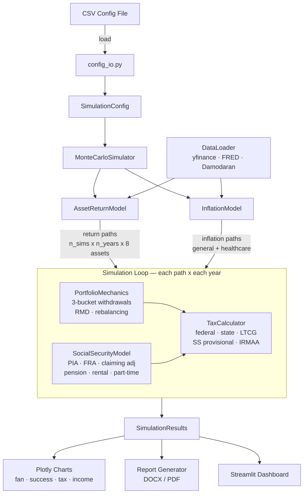

# Monte Carlo Retirement Simulator

A Python Streamlit application for retirement planning using Monte Carlo simulation with stochastic asset returns, inflation modeling, tax-aware withdrawals, and Social Security calculations.

## Features

- **Monte Carlo simulation** with configurable number of paths (100–10,000)
- **8 asset classes** — US Large/Small Cap, International Developed, Emerging Markets, US Bonds, TIPS, REITs, Cash
- **Two return models** — Block bootstrap (historical) or GBM (Cholesky-correlated)
- **Three inflation models** — Bootstrap, fixed rate, or mean-reverting (Ornstein-Uhlenbeck)
- **Tax-aware 3-bucket withdrawals** — Taxable → Traditional (≥RMD) → Roth ordering
- **Federal + state taxes** — 2025 brackets, LTCG rates, Social Security provisional income, IRMAA
- **Social Security modeling** — PIA from AIME, claiming age adjustments, basic spousal benefits
- **Income overlays** — Pension, rental income, part-time work with age-based start/stop
- **Glide-path allocation** with threshold rebalancing
- **Interactive Plotly charts** — Fan charts, success curves, tax burden, income stacking, and more
- **Report export** — DOCX and PDF with charts, tables, and executive summary
- **CSV config import/export** — Save and reload simulation configurations

## Simulation Flow



## Quick Start

```bash
# Clone the repo
git clone https://github.com/YOUR_USERNAME/monte-carlo-retirement.git
cd monte-carlo-retirement

# Create virtual environment
python -m venv .venv
source .venv/bin/activate  # macOS/Linux
# .venv\Scripts\activate   # Windows

# Install dependencies
pip install -r requirements.txt

# Run the app
streamlit run app.py
```

## Configuration

The simulator is fully configurable through the Streamlit sidebar or via CSV files.

### Using the UI
All parameters are adjustable in the sidebar: ages, balances, allocation targets, spending, Social Security inputs, tax assumptions, and model settings.

### CSV Import/Export
Save your configuration to CSV from the sidebar, or load a previously saved configuration. See `sample_config.csv` for the expected format.

```bash
# Run with a specific config
# Load via the sidebar "Import Config" button in the UI
```

## Running Tests

```bash
# Run the full test suite
pytest tests/ -v

# Run a specific test file
pytest tests/test_module_logic.py -v

# Run a specific test
pytest tests/test_system.py -k "test_name" -v
```

## Architecture

See [ARCHITECTURE.md](ARCHITECTURE.md) for the full architecture documentation including module responsibilities, data flow, dependency graph, and extension points.

## Premium Features

A premium version is available with additional capabilities for advanced financial planning. See [docs/PREMIUM_FEATURES.md](docs/PREMIUM_FEATURES.md) for details.

## Contributing

See [CONTRIBUTING.md](CONTRIBUTING.md) for guidelines on contributing to this project.

## License

This project is licensed under the MIT License. See [LICENSE](LICENSE) for details.
